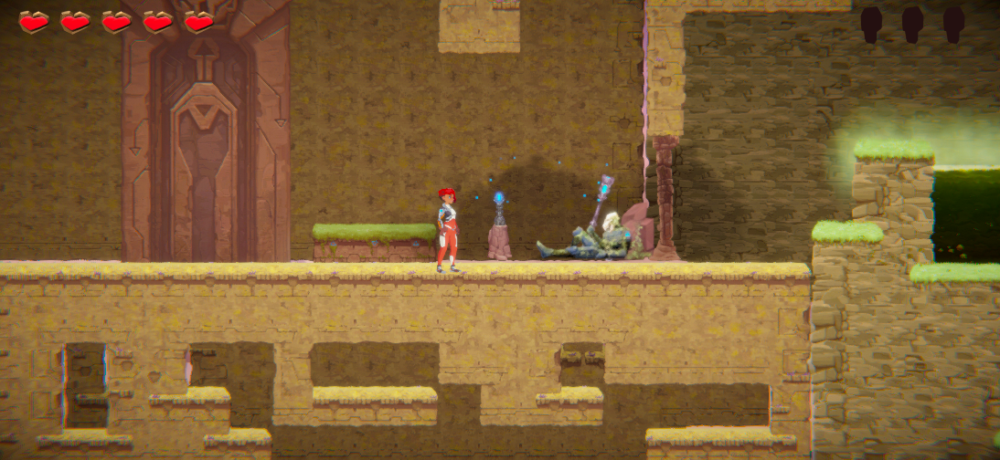
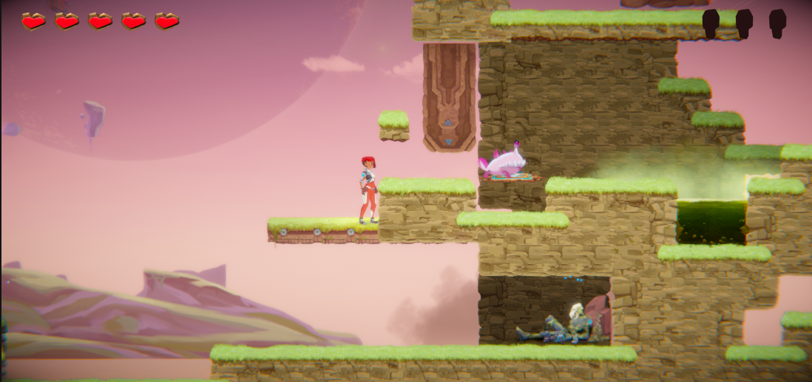
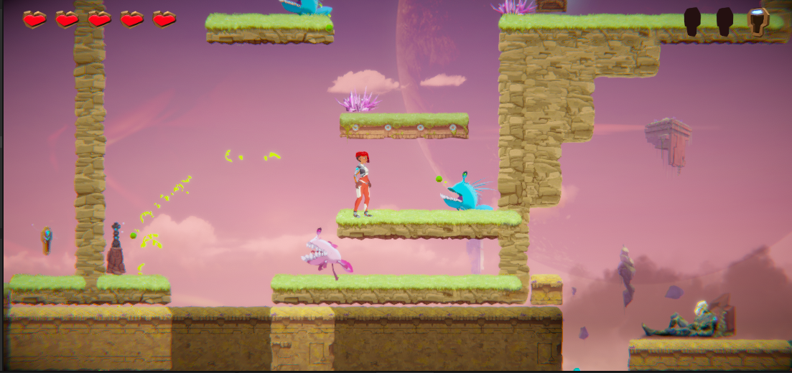
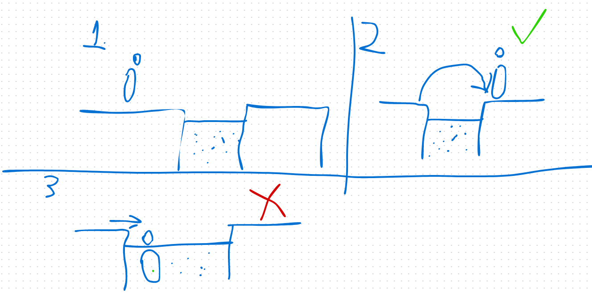
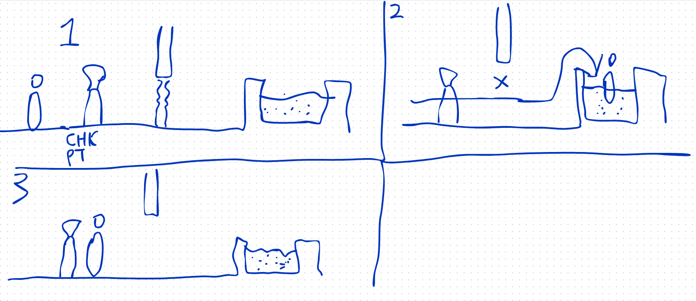
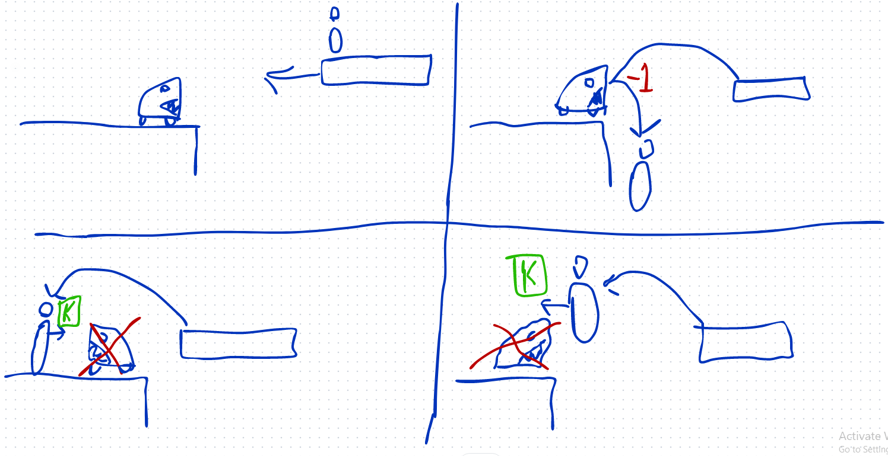
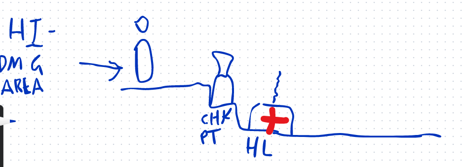
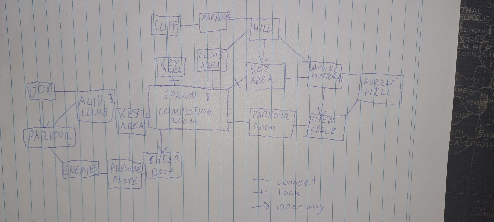

# COMP2150  - Level Design Document
### Name: Brandon Power
### Student number: 47391111 
## 1. Player Experience (~700 words)

### 1.1. Discovery
The first path introduces basic examples of concepts such as parkour, enemies, gun and staff, health, and activation mechanics.
For example, the player starts in a room with no exits or interactable elements other than a staff and a wall.

This forces the player to experiment until it understands the basic use of a staff.
This can also be seen with the introduction of the gun.

The only way forward is to shoot the chomper, releasing the pressure plate and opening the door.
However, this one requires a small extra step in which the player must actively divert their path from the obvious in order to retrieve the ability to shoot the gun. The player will understand that the (corpse?) has something to take due to them having taken their staff from the previous corpse.
On the broader scope of player obejctives, the player starts the level in the very room that has the exit point for the level. As they venture through each path that eventually takes them back to this main room, the idea that the large door in the centre of the room is the requirement for leaving is planted in their mind. This is reinforced when the player encounters a key at the end of each discrete path, a hint to the final goal of the level. 

### 1.2. Drama
Drama is employed by balancing damaging objects such as enemies, acid, or spikes, with checkpoints, health boxes, and objective completion.
The goal of this level is to introduce mechanics and to give players and understanding of their uses. As such, there should not be many moments of high-intensity.
Instead the moments of intensity and relief are quite forgiving in that full health boxes are given after most challenges. Additionally, the two methods of attacking are given quite early on in the level in order to provide the player with greater options.
However, there are still points in which tension can be found. For example, on entry to Path 2, the player will encounter multiple Spitters, on different platforms, with increased range and Field of View, which essentially creates a box where damage from multiple angles is being targeted at the player. In addition to the spikes that are placed to inhibit an easy jump up to escape the ambush, this creates a sense of urgency within the player as it is easy to lose control of the character and take a lot of damage and fall back down into the hole if they don't stay calm.
 

### 1.3. Challenge
The main challenge in this level is to effectively use the skills the player has learnt to finish each path and acquire the keys.
In order to maintain flow, the level first introduces the basic ideas of parkour, melee, shooting, and puzzles in Path 1. Path 2 and Path 3 follow on with this idea by branching and focusing on separate aspects.
Path 2 requires higher manouverability and combat skill through the use of integrating multiple enemies with multiple platforms, creating a two-dimensional battlefield. Path 2 demonstrates the mechanical skill required for a game like this.
Path 3 focuses on the puzzle aspect introduces in Path 1. While still simple, the puzzle requires the player to understand the logic of moving boxes, activation objects (in this case, a pressure plate), and thus creating a desired effect such as opening a door.

### 1.4. Exploration
This level is not particularly complicated or three-dimensional. However, it does give the illusion of a varied map by directing the player most directions at specific points in time and space.
Path 1, also known as the introductory path will always be the path players will need to go through first. Traditionally, platformers require the player to move to the right of the screen. This is also the case with Path 1, at least until it loops back around to the main room. By following the traditional platforming exploration route and then forcing the player to then go back to the room in which they started, by combining the familiar with the somewhat less so, it demonstrates how this game requires the exploration of all possibilities within a space.
After that, autonomy is given to the player by opening up Path 2 and 3 to explore in any order.

## 2. Core Gameplay (~400 words)
A section on Core Gameplay, where storyboards are used to outline how you introduce the player to each of the required gameplay elements in the first section of the game. Storyboards should follow the format provided in lectures.

Storyboards can be combined when multiple mechanics are introduced within a single encounter. Each section should include a sentence or two to briefly justify why you chose to introduce the mechanic/s to the player in that sequence.

You should restructure the headings below to match the order they appear in your level.

### 2.1. Acid

### 2.2. Checkpoints

### 2.3. Chompers

### 2.4. Health Pickups

### 2.5. Keys

### 2.6. Moving Platforms

### 2.7. Passthrough Platforms

### 2.8. Spikes

### 2.9. Spitters

### 2.10. Weapon Pickup (Gun)

### 2.11. Weapon Pickup (Staff)

## 3. Spatiotemporal Design
A section on Spatiotemporal Design, which includes your molecule diagram and annotated level maps (one for each main section of your level). These diagrams may be made digitally or by hand, but must not be created from screenshots of your game. The annotated level maps should show the structure you intend to build, included game elements, and the path the player is expected to take through the level. Examples of these diagrams are included in the level design lectures.

No additional words are necessary for this section (any words should only be within your images/diagrams).
 
### 3.1. Molecule Diagram

### 3.2. Level Map – Section 1

### 3.3.	Level Map – Section 2

### 3.4.	Level Map – Section 3

## 4. Iterative Design (~400 words)
Reflect on how iterative design helped to improve your level. Additional prototypes and design artefacts should be included to demonstrate that you followed an iterative design process (e.g. pictures of paper prototypes, early grey-boxed maps, additional storyboards of later gameplay sequences, etc.). You can also use this section to justify design changes made in Unity after you drew your level design maps shown in section 3. 

You should conclude by highlighting a specific example of an encounter, or another aspect of your level design, that could be improved through further iterative design.

## Generative AI Use Acknowledgement

Use the below table to indicate any Generative AI or writing assistance tools used in creating your document. Please be honest and thorough in your reporting, as this will allow us to give you the marks you have earnt. Place any drafts or other evidence inside this repository. This form and related evidence do not count to your word count.
An example has been included. Please replace this with any actual tools, and add more as necessary.

### Tool Used: ChatGPT
**Nature of Use** Finding relevant design theory.

**Evidence Attached?** Screenshot of ChatGPT conversation included in the folder "GenAI" in this repo.

**Additional Notes:** I used ChatGPT to try and find some more relevant design theory that I could apply to my game. After googling them, however, I found most of them were inaccurate, and some didn't exist. One theory mentioned, however, was useful, and I've incorporated it into my work.

### Tool Used: Example
**Nature of Use** Example Text

**Evidence Attached?** Example Text

**Additional Notes:** Example Text

